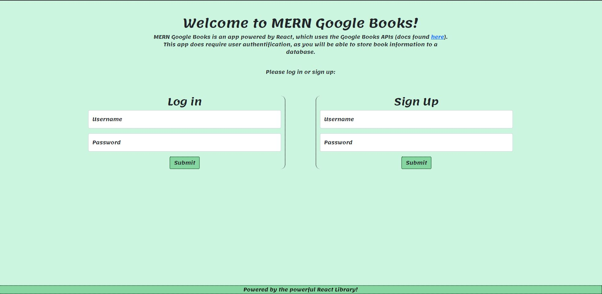
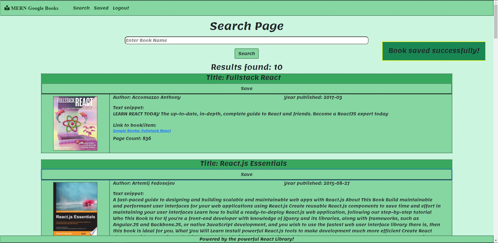
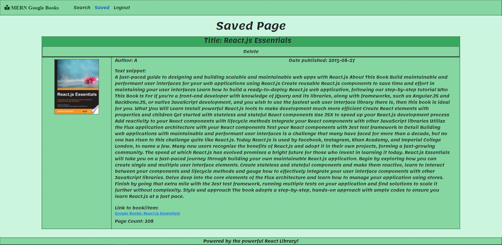

# MERN Google Books

A React web application used to search for books using the Google Books API, as well as save data to MongoDB through CRUD operations.
## Link to Deployed Application 🔗

_https://whispering-springs-93162.herokuapp.com/_

## Table of Contents

1. [Project Description](#project-description)
2. [What to Expect From the Application](#What-to-Expect-From-the-Application)
3. [Tech Stack](#Tech-Stack)
4. [Goals for Deployment](#Goals-for-Deployment)
5. [Screenshots](#Screenshots)

## Project Description 

The purpose of this project is to create a full stack MERN (Mongo-Express-React-Node) application that will allow a user to send server requests through interaction with React components. I used the axios npm package to perform request methods like GET, POST, and DELETE. The server is set up using Express.js, and the database used is MongoDB, hence the MERN acronym! Users will be able to make their own (encrypted) login, search for books by sending a GET request to the Google Books API and returning response data, and save (or delete) books to a database using a one:many relationship.
## What to Expect From the Application

Google has many APIs that are very commonly used in every day life. In fact, we use a lot of these APIs just through google.com! When we send a search query on google.com, we are utilizing a Google API at that moment. The links such as Shopping, Images, and even Books, utilize an individual API! So for this application, I am essentially using the technology from the "Books" link to allow a user to search for any book by title, and give them the ability to save that book (or item) to a saved page for later retrieval. Since these saved books are stored through MongoDB Atlas, the user can always come back to the page, sign up or sign in, and retrieve their list at any time!

## Tech Stack

* Front-end: CSS3/HTML5
* Front-end/back-end logic: Javascript
* User-Interface: React.js
* Server: Express.js
* Database: MongoDB
* ODM: Mongoose
* Package Handler: Node.js
* Google Books API
## Goals for Deployment

- [x] A user will be able to either sign up, or log into their own personal account
- [x] When the user logs in or signs up, they are immediately taken to the search page
- [x] When the user submits a search, books will neatly populate the screen with results relevant to the search
- [x] When the user clicks the saved link in the navbar, they are taken to the Saved page
- [x] All of the user's saved books will be displayed in the same manner as the Search page
- [x] When the user clicks the delete button, the book will be removed and the page will refresh to reflect the change
- [x] When the user clicks the logout link in the navbar, they will be signed out and directed to the home page.

## Screenshots

